# Travel Planner App ✈️🌍

A Flutter mobile application that helps users generate personalized travel plans
based on their destination, budget, and trip duration.

---

## Features

### Authentication
- Login
- Register
- Email Verification
- Forgot Password
- Reset Password with Verification Code

### User Features
- Generate travel trips
- View trip history
- View itinerary days
- View daily activities
- Add trips to favorites
- Add preferences to help AI generate trips
- Update profile (email, image, password, phone number, name)

### Admin Features
- Manage users
- Block / Unblock users
- Admin profile management

### Support & Feedback
- Report Issues: Users can report bugs or problems directly to the admin.
- Contact Support: Integrated communication via Email or Phone.
- About App: Information about the version, mission, and creators.

### 🎨 User Experience (UX)
- **Splash Screen:** Native splash screen for smooth app initialization.
- **Onboarding Flow:** Interactive guide for new users to understand the app's value.
- **Loading & Error Handling:** Loading indicators and clear error handling

---

## 📸 Screenshots

### 🌟 Onboarding & Introduction
| Welcome Screen |
|----------------|
| 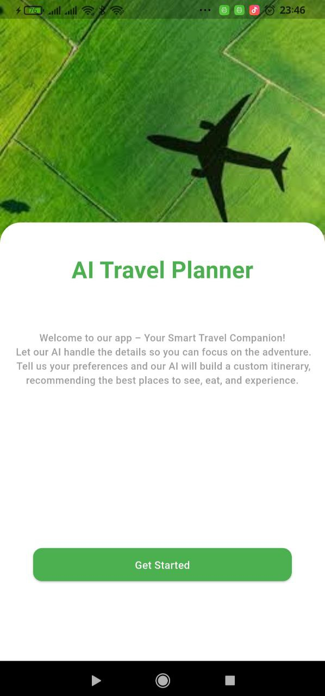

### 🔐 Authentication Flow
| Login | Register | OTP Verification |
|-------|----------|------------------|
| 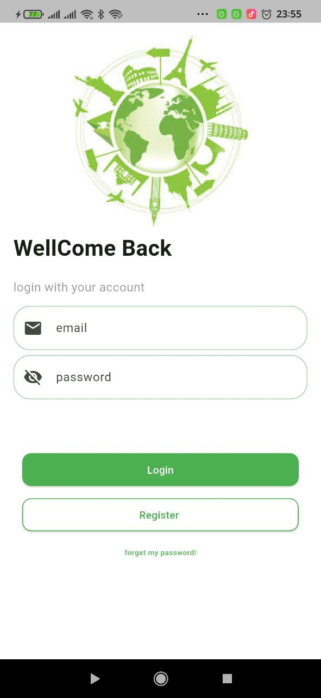 | 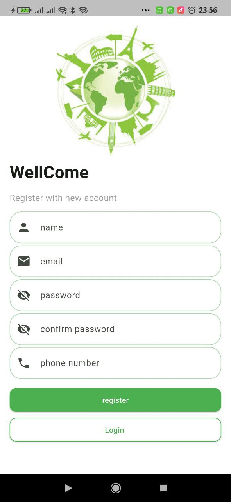 | 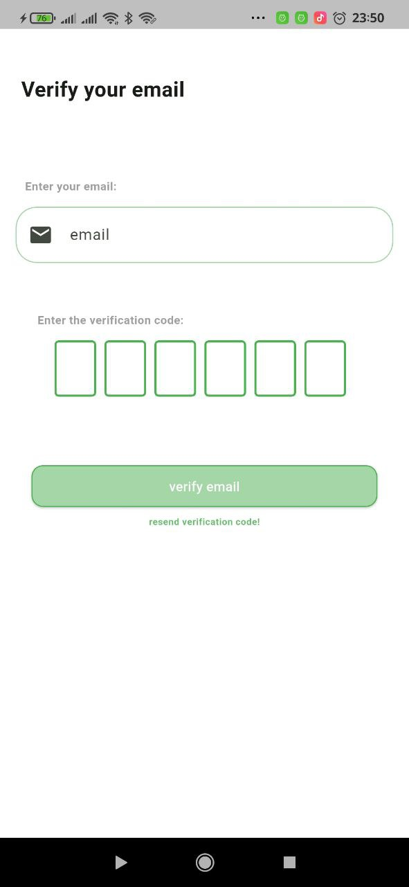 |
|-------|----------|------------------|
| Forget Password | Reset Password With Verification |
| 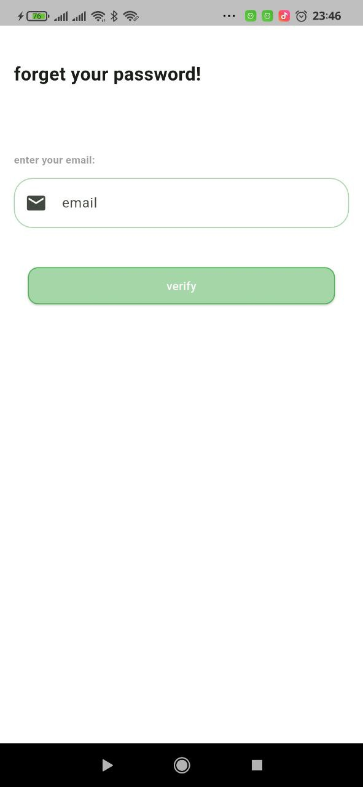 | 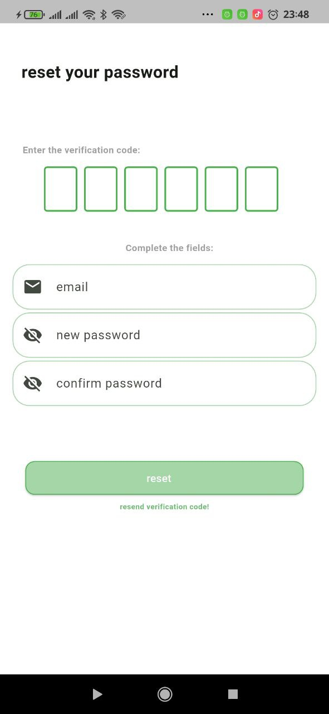 |

### ✈️ Trip Planning & AI
| User Preference |
|-----------------| 
| 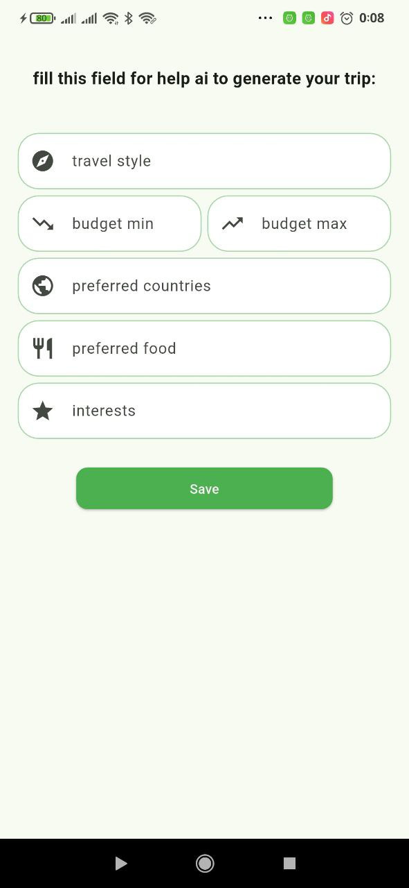 |
|--------------------------------------------------|

| Generate Trip | Trip | Itinerary Days | Activity |
|---------------|------|----------------|----------|
| 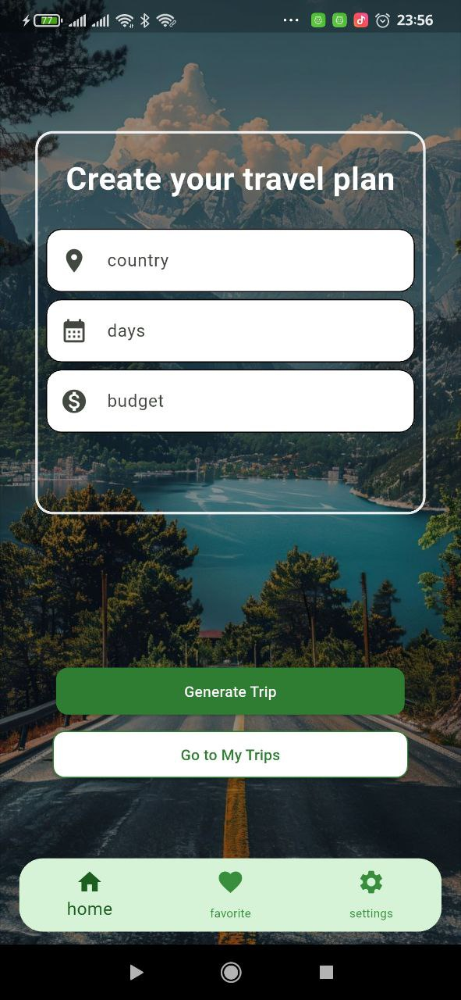 | 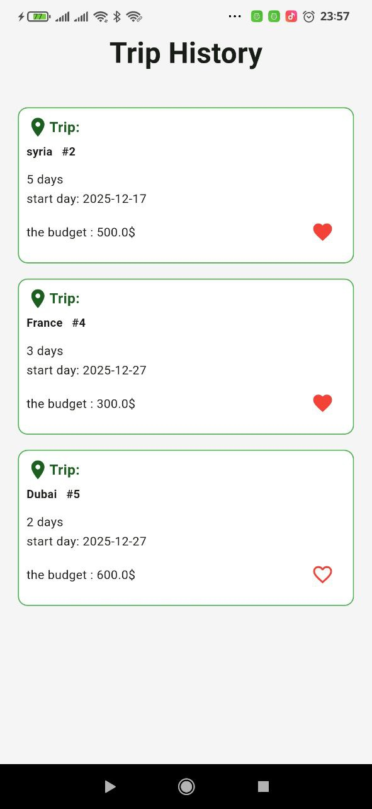 | 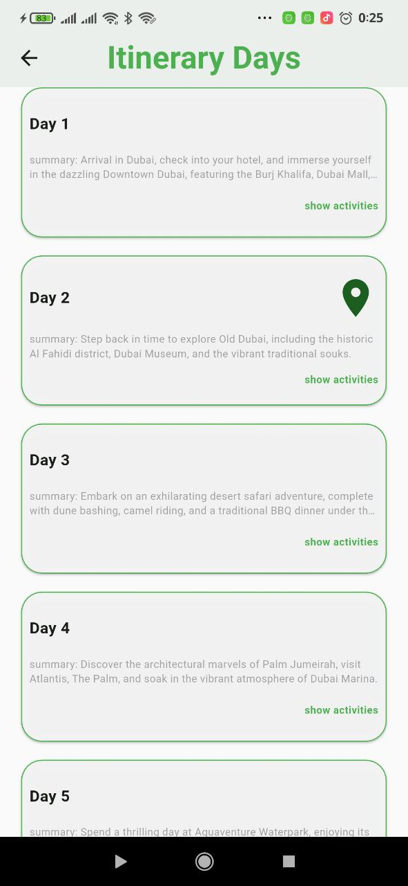 | 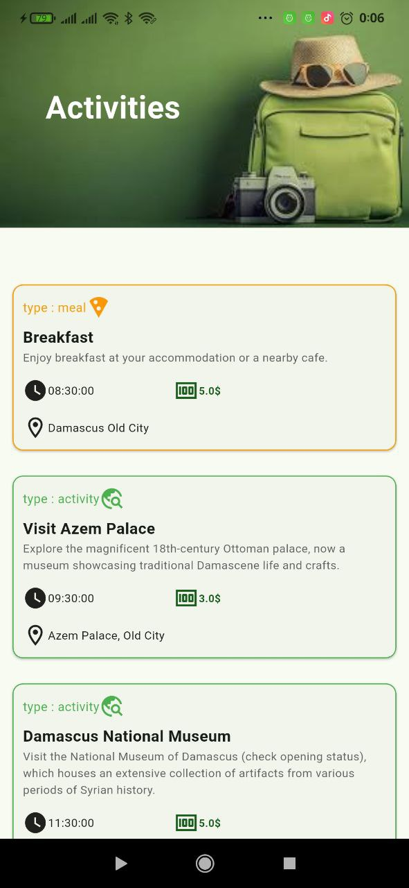 |

### 🛠️ Admin & Profile
| Admin Dashboard |
|-----------------|
| 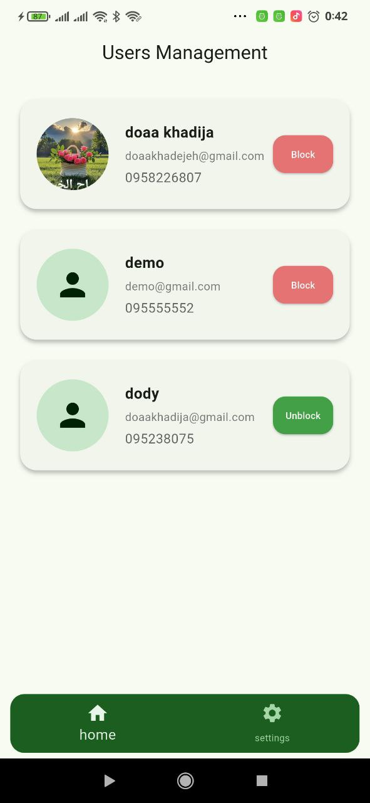 

---

## Tech Stack
- Flutter
- BLoC (Cubit)
- Dio (HTTP Client)
- Pretty Dio Logger
- REST API
- Laravel (Backend)
- GoRouter
- Get It (Dependency Injection)
- Dartz (Functional Error Handling)
- Equatable
- Flutter ScreenUtil
- Shared Preferences
- Flutter Secure Storage
- Flutter Native Splash
- Url Launcher

---
## Roadmap (Upcoming Features)
- Multi-language support (Localization).
- PDF export for travel itineraries.
- Offline mode using Hive or Drift.
